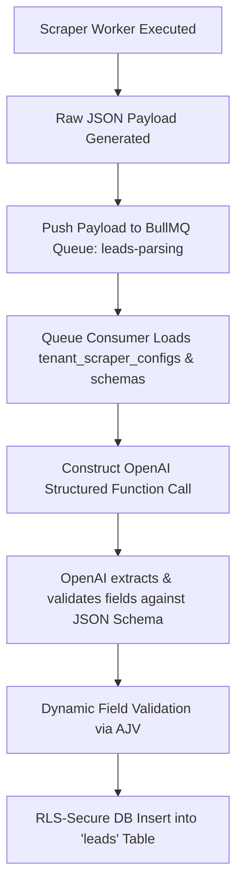
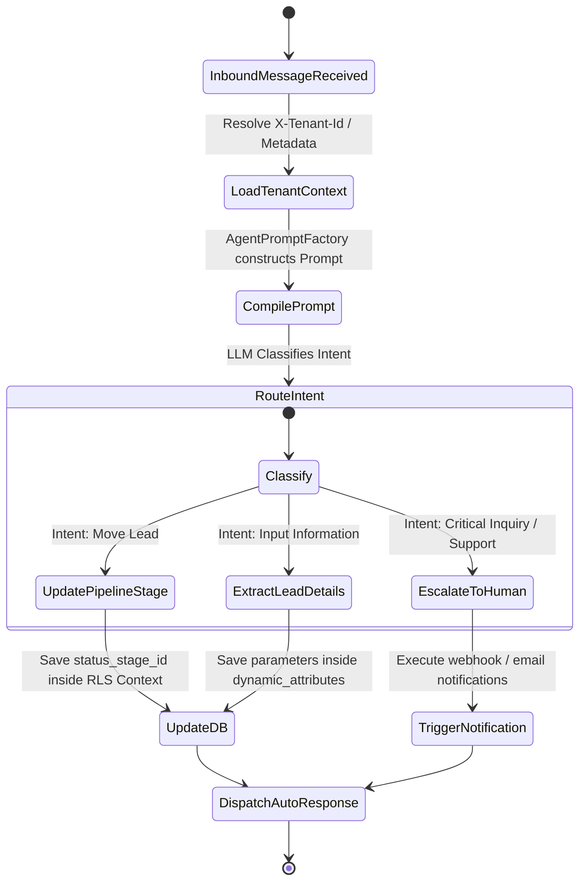

# Multi-Tenant B2B SaaS Agentic CRM & Lead Scraper Engine
## Unified Technical Architecture Blueprint

This document defines the production-ready architecture, database schemas, prompt-injection pipelines, and asynchronous queues required to transition our Lead Scraper & CRM platform into a highly scalable, multi-tenant B2B SaaS system. 

---

## 1. THE MULTI-TENANT DATABASE ARCHITECTURE

To guarantee 100% data isolation while supporting arbitrary industry profiles (e.g., Hospitals, Hotels, Malls), the platform implements a **Shared Database, Row-Level Security (RLS) and Schema-on-Read Metadata model** using PostgreSQL.

### 1.1 Database Schema (SQL DDL)

```sql
-- Enable UUID extension
CREATE EXTENSION IF NOT EXISTS "uuid-ossp";

-- Tenant Definition Table
CREATE TABLE tenants (
    id UUID PRIMARY KEY DEFAULT uuid_generate_v4(),
    name VARCHAR(255) NOT NULL,
    industry_profile VARCHAR(100) NOT NULL, -- e.g., 'healthcare', 'hospitality', 'real_estate'
    subscription_tier VARCHAR(50) NOT NULL DEFAULT 'free', -- 'free', 'pro', 'enterprise'
    created_at TIMESTAMP WITH TIME ZONE DEFAULT CURRENT_TIMESTAMP NOT NULL,
    updated_at TIMESTAMP WITH TIME ZONE DEFAULT CURRENT_TIMESTAMP NOT NULL
);

-- Tenant Custom Vocabularies & Fields Config (JSON Schema)
CREATE TABLE tenant_schemas (
    id UUID PRIMARY KEY DEFAULT uuid_generate_v4(),
    tenant_id UUID UNIQUE REFERENCES tenants(id) ON DELETE CASCADE NOT NULL,
    lead_vocab JSONB NOT NULL, -- Stores custom singular/plural names (e.g., {"singular": "Patient", "plural": "Patients"})
    lead_fields JSONB NOT NULL, -- JSON Schema validating the custom structure of the dynamic fields
    pipeline_stages JSONB NOT NULL, -- Dynamic CRM phases e.g., [{"id": "stage_1", "label": "Triage", "color": "#ff0000"}]
    created_at TIMESTAMP WITH TIME ZONE DEFAULT CURRENT_TIMESTAMP NOT NULL,
    updated_at TIMESTAMP WITH TIME ZONE DEFAULT CURRENT_TIMESTAMP NOT NULL
);

-- Unified Leads (Contacts) Table
CREATE TABLE leads (
    id UUID PRIMARY KEY DEFAULT uuid_generate_v4(),
    tenant_id UUID REFERENCES tenants(id) ON DELETE CASCADE NOT NULL,
    name VARCHAR(255) NOT NULL,
    email VARCHAR(255),
    phone VARCHAR(50),
    source VARCHAR(100) NOT NULL,
    status_stage_id VARCHAR(100) NOT NULL DEFAULT 'new', -- Maps to custom stages inside tenant_schemas
    dynamic_attributes JSONB NOT NULL DEFAULT '{}'::jsonb, -- Custom values mapped via AJV validator
    created_at TIMESTAMP WITH TIME ZONE DEFAULT CURRENT_TIMESTAMP NOT NULL,
    updated_at TIMESTAMP WITH TIME ZONE DEFAULT CURRENT_TIMESTAMP NOT NULL,
    
    -- Ensure unique contacts per tenant to allow overlapping emails between separate tenants
    CONSTRAINT unique_tenant_lead_email UNIQUE (tenant_id, email)
);

-- Indexing for optimized filtering and metadata search
CREATE INDEX idx_leads_tenant ON leads(tenant_id);
CREATE INDEX idx_leads_dynamic_attrs ON leads USING gin (dynamic_attributes);
CREATE INDEX idx_leads_status_stage ON leads(tenant_id, status_stage_id);
```

### 1.2 Tenant Data Privacy: Row-Level Security (RLS)

To secure operations at the database layer (preventing Business A from ever peeking into Business B's data), PostgreSQL Row-Level Security (RLS) is locked down. RLS utilizes context from both Supabase Auth JWT claims (for direct web client calls) and manual transaction session variables (for backend scripts and API worker contexts).

```sql
-- Enable Row Level Security on Leads
ALTER TABLE leads ENABLE ROW LEVEL SECURITY;
ALTER TABLE tenant_schemas ENABLE ROW LEVEL SECURITY;

-- Dynamic Tenant Context Resolution Policy
-- Resolves tenant context from either the active Supabase Auth JWT claim OR a secure session setting
CREATE OR REPLACE FUNCTION current_tenant_id() RETURNS UUID AS $$
BEGIN
    RETURN COALESCE(
        NULLIF(current_setting('app.current_tenant_id', true), '')::UUID,
        (auth.jwt() -> 'app_metadata' ->> 'tenant_id')::UUID
    );
EXCEPTION WHEN OTHERS THEN
    RETURN (auth.jwt() -> 'app_metadata' ->> 'tenant_id')::UUID;
END;
$$ LANGUAGE plpgsql SECURITY DEFINER;

-- Leads Access Isolation Policy
CREATE POLICY tenant_isolation_leads_policy ON leads
    FOR ALL
    USING (tenant_id = current_tenant_id())
    WITH CHECK (tenant_id = current_tenant_id());

-- Tenant Schemas Access Isolation Policy
CREATE POLICY tenant_isolation_schemas_policy ON tenant_schemas
    FOR ALL
    USING (tenant_id = current_tenant_id())
    WITH CHECK (tenant_id = current_tenant_id());
```

*NestJS Backend Implementation (RLS Middleware Context Wrapper):*
```typescript
import { Injectable, NestMiddleware } from '@nestjs/common';
import { Request, Response, NextFunction } from 'express';
import { PrismaService } from '../prisma/prisma.service';

@Injectable()
export class TenantMiddleware implements NestMiddleware {
  constructor(private readonly prisma: PrismaService) {}

  async use(req: Request, res: Response, next: NextFunction) {
    const tenantId = req.headers['x-tenant-id'] as string; // Set after JWT verification
    if (tenantId) {
      // Execute local transaction query setting session config
      await this.prisma.$executeRawUnsafe(
        `SET LOCAL app.current_tenant_id = '${tenantId}';`
      );
    }
    next();
  }
}
```

### 1.3 Dynamic Schema Verification (Validation Engine)

When saving or updating a lead, the JSON payload in `dynamic_attributes` is verified against the dynamic schema registered under the tenant's `tenant_schemas` table using `ajv` (Another JSON Schema Validator).

```typescript
import { Injectable, BadRequestException } from '@nestjs/common';
import Ajv from 'ajv';
import { PrismaService } from '../prisma/prisma.service';

@Injectable()
export class DynamicSchemaValidationService {
  private ajv = new Ajv({ allErrors: true, coerceTypes: true });

  constructor(private prisma: PrismaService) {}

  async validateLeadAttributes(tenantId: string, payload: Record<string, any>): Promise<boolean> {
    const schemaRecord = await this.prisma.tenantSchema.findUnique({
      where: { tenantId },
    });

    if (!schemaRecord) {
      throw new BadRequestException('Tenant metadata schema not defined.');
    }

    const jsonSchema = schemaRecord.lead_fields as any;
    
    // Compile and validate via AJV
    const validate = this.ajv.compile(jsonSchema);
    const valid = validate(payload);

    if (!valid) {
      const errorDetails = validate.errors?.map((err) => `${err.instancePath} ${err.message}`).join(', ');
      throw new BadRequestException(`Schema validation failed: ${errorDetails}`);
    }

    return true;
  }
}
```

---

## 2. UNIVERSAL SCRAPER CONFIGURATION ENGINE

To democratize lead generation, non-technical tenants can configure crawlers targeting platforms (Google Maps, YellowPages, Yelp) and map structural scraper properties directly into custom CRM schema columns.

### 2.1 Dynamic Scraper Configuration Table
```sql
CREATE TABLE tenant_scraper_configs (
    id UUID PRIMARY KEY DEFAULT uuid_generate_v4(),
    tenant_id UUID REFERENCES tenants(id) ON DELETE CASCADE NOT NULL,
    name VARCHAR(255) NOT NULL,
    sources VARCHAR(100)[] NOT NULL, -- e.g., ['google_maps', 'yelp']
    search_keywords VARCHAR(255)[] NOT NULL,
    target_locations VARCHAR(255)[] NOT NULL,
    field_mappings JSONB NOT NULL, -- Maps scraper variables to CRM JSON fields
    is_active BOOLEAN DEFAULT true NOT NULL,
    created_at TIMESTAMP WITH TIME ZONE DEFAULT CURRENT_TIMESTAMP NOT NULL,
    updated_at TIMESTAMP WITH TIME ZONE DEFAULT CURRENT_TIMESTAMP NOT NULL
);
CREATE INDEX idx_scraper_tenant ON tenant_scraper_configs(tenant_id);
```

### 2.2 Scraper Setup UI/UX Workflow
The interface guides a non-technical tenant through a 3-step setup wizard:
1. **Target Parameters**: Inputs search terms (e.g. `Dental Clinics`, `Boutique Hotels`) and geographical targets (e.g. `Austin, TX`, `Mumbai, MH`).
2. **Platform Routing Selector**: Checkbox triggers mapping to scrapers (`Google Maps`, `YellowPages`, `Yelp`).
3. **Data Field Mapper Matrix**: Displays dynamic fields resolved from `tenant_schemas.lead_fields` side-by-side with incoming raw scraper values (represented as standard data keys). The user maps raw to custom (e.g., mapping raw `Street Address` → custom `Hospital Branch Location`).

### 2.3 Asynchronous Queue & AI Parsing Middleware

When raw scraper scripts complete (using queues built via `BullMQ`), unstructured payloads are routed to the **AI Parsing Middleware**. An LLM parses the payload, extracts values, resolves them against tenant configurations, and saves the records.



*BullMQ Parsing Ingestion Consumer:*
```typescript
import { Processor, WorkerHost } from '@nestjs/bullmq';
import { Job } from 'bullmq';
import { PrismaService } from '../prisma/prisma.service';
import { OpenAI } from 'openai';
import { DynamicSchemaValidationService } from './validation.service';

@Processor('leads-parsing')
export class LeadsParsingConsumer extends WorkerHost {
  private openai = new OpenAI({ apiKey: process.env.OPENAI_API_KEY });

  constructor(
    private prisma: PrismaService,
    private validationService: DynamicSchemaValidationService
  ) {
    super();
  }

  async process(job: Job<{ tenantId: string; configId: string; rawData: any }>): Promise<any> {
    const { tenantId, configId, rawData } = job.data;

    // 1. Fetch scraper configurations and validation schemas
    const [scraperConfig, tenantSchema] = await Promise.all([
      this.prisma.tenantScraperConfig.findUnique({ where: { id: configId } }),
      this.prisma.tenantSchema.findUnique({ where: { tenantId } }),
    ]);

    if (!scraperConfig || !tenantSchema) {
      throw new Error(`Execution halted: Config or Schema missing for tenant ${tenantId}`);
    }

    // 2. Invoke OpenAI with JSON Schema constraints
    const prompt = `
      Extract structured data matching the specified schema format.
      Raw Payload: ${JSON.stringify(rawData)}
      Field Mapping: ${JSON.stringify(scraperConfig.field_mappings)}
    `;

    const completion = await this.openai.chat.completions.create({
      model: 'gpt-4o-mini',
      messages: [{ role: 'user', content: prompt }],
      response_format: { type: 'json_object' },
    });

    const parsedAttributes = JSON.parse(completion.choices[0].message.content || '{}');

    // 3. Run validation against custom AJV dynamic schema
    await this.validationService.validateLeadAttributes(tenantId, parsedAttributes);

    // 4. Write data inside Tenant Context RLS Scope
    await this.prisma.$transaction(async (tx) => {
      await tx.$executeRawUnsafe(`SET LOCAL app.current_tenant_id = '${tenantId}';`);
      
      await tx.lead.create({
        data: {
          tenant_id: tenantId,
          name: parsedAttributes.name || 'Anonymous Business',
          email: parsedAttributes.email,
          phone: parsedAttributes.phone,
          source: scraperConfig.name,
          status_stage_id: 'new',
          dynamic_attributes: parsedAttributes,
        },
      });
    });
  }
}
```

---

## 3. "ANY-BUSINESS" ONBOARDING & SETUP TEMPLATES

To facilitate instant setups, when a new tenant registers, they select an industry template. Choosing a template automatically seeds their schema configs and triggers targeted scraping protocols.

### Template A: Healthcare & Medical Clinics

```json
{
  "industry_profile": "healthcare",
  "lead_vocab": {
    "singular": "Patient",
    "plural": "Patients"
  },
  "lead_fields": {
    "$schema": "http://json-schema.org/draft-07/schema#",
    "type": "object",
    "properties": {
      "patient_name": { "type": "string" },
      "primary_ailment": { "type": "string" },
      "insurance_provider": { "type": "string" },
      "desired_appointment_date": { "type": "string", "format": "date" },
      "doctor_assigned": { "type": "string" }
    },
    "required": ["patient_name", "primary_ailment"]
  },
  "pipeline_stages": [
    { "id": "triage", "label": "Triage / Initial Review", "color": "#E53E3E" },
    { "id": "scheduled", "label": "Consultation Scheduled", "color": "#DD6B20" },
    { "id": "admitted", "label": "Undergoing Treatment", "color": "#3182CE" },
    { "id": "discharged", "label": "Discharged & Billing", "color": "#38A169" }
  ],
  "scraper_protocols": {
    "target_sources": ["local_medical_directories", "google_maps"],
    "default_keywords": ["Family Clinics", "Private Hospitals", "Cardiology Centers"],
    "field_mapping": {
      "patient_name": "name",
      "primary_ailment": "category",
      "insurance_provider": "unstructured_metadata.insurance_accepted"
    }
  },
  "critical_automations": [
    {
      "trigger": "status_stage_changed_to_triage",
      "action": "send_sms_via_twilio",
      "payload": { "message": "Hello {{patient_name}}, a clinic coordinator is reviewing your consultation inquiry details." }
    }
  ]
}
```

### Template B: Hospitality, Events & Hotels

```json
{
  "industry_profile": "hospitality",
  "lead_vocab": {
    "singular": "Guest Prospect",
    "plural": "Guest Prospects"
  },
  "lead_fields": {
    "$schema": "http://json-schema.org/draft-07/schema#",
    "type": "object",
    "properties": {
      "guest_name": { "type": "string" },
      "event_type": { "type": "string", "enum": ["Wedding", "Conference", "Retreat", "Banquet"] },
      "estimated_attendees": { "type": "integer", "minimum": 1 },
      "room_nights_required": { "type": "integer" },
      "booking_budget": { "type": "number" }
    },
    "required": ["guest_name", "event_type"]
  },
  "pipeline_stages": [
    { "id": "inquiry", "label": "Lead Inquiry Received", "color": "#805AD5" },
    { "id": "proposal", "label": "Proposal Sent", "color": "#319795" },
    { "id": "negotiation", "label": "Contract Negotiation", "color": "#D69E2E" },
    { "id": "confirmed", "label": "Booking Confirmed", "color": "#38A169" }
  ],
  "scraper_protocols": {
    "target_sources": ["linkedin", "corporate_directories", "google_maps"],
    "default_keywords": ["Wedding Planners", "Event Management Agencies", "Corporate Relocation"],
    "field_mapping": {
      "guest_name": "contact_person",
      "event_type": "tags.0",
      "booking_budget": "unstructured_metadata.corporate_budget"
    }
  },
  "critical_automations": [
    {
      "trigger": "status_stage_changed_to_proposal",
      "action": "send_email_via_resend",
      "payload": {
        "subject": "Exclusive Venue Proposal - {{event_type}}",
        "template": "hotel_proposal_email"
      }
    }
  ]
}
```

### Template C: Commercial Malls & Real Estate

```json
{
  "industry_profile": "real_estate",
  "lead_vocab": {
    "singular": "Retail Tenant Prospect",
    "plural": "Retail Tenant Prospects"
  },
  "lead_fields": {
    "$schema": "http://json-schema.org/draft-07/schema#",
    "type": "object",
    "properties": {
      "brand_name": { "type": "string" },
      "retail_category": { "type": "string" },
      "desired_square_footage": { "type": "integer" },
      "target_mall_zone": { "type": "string" },
      "proposed_lease_term_months": { "type": "integer" }
    },
    "required": ["brand_name", "retail_category"]
  },
  "pipeline_stages": [
    { "id": "lead_prospect", "label": "Lease Prospect Inbound", "color": "#4A5568" },
    { "id": "loi_stage", "label": "Letter of Intent Signed", "color": "#3182CE" },
    { "id": "legal_review", "label": "Lease Agreement Under Legal Review", "color": "#E53E3E" },
    { "id": "signed_occupied", "label": "Lease Signed & Store Occupied", "color": "#38A169" }
  ],
  "scraper_protocols": {
    "target_sources": ["retail_franchise_registries", "google_maps"],
    "default_keywords": ["Apparel Boutiques", "Fitness Franchises", "Specialty Coffee Shops"],
    "field_mapping": {
      "brand_name": "name",
      "retail_category": "category",
      "desired_square_footage": "unstructured_metadata.estimated_floor_size"
    }
  },
  "critical_automations": [
    {
      "trigger": "status_stage_changed_to_legal_review",
      "action": "trigger_webhook",
      "payload": {
        "webhook_url": "https://hooks.slack.com/services/mall/legal-alerts",
        "message": "URGENT: Legal lease review initiated for Brand: {{brand_name}} (Category: {{retail_category}})."
      }
    }
  ]
}
```

---

## 4. MONETIZATION & VALUE-BASED PRICING MODEL

The monetization strategy maps limits directly to tenant usage matrices to capture expansion revenue dynamically.

| Tier Feature | Free Tier | Pro Tier | Enterprise Tier |
| :--- | :--- | :--- | :--- |
| **Monthly Scraped Leads** | Up to 500 / month | Up to 10,000 / month | Unlimited (Soft Cap at 100k) |
| **Active Team Members** | Max 2 users | Max 15 users | Unlimited |
| **Scraper Profiles** | Max 1 configuration | Max 10 configurations | Unlimited |
| **AI Agents Allowed** | None | 2 active Agent profiles | Unlimited custom agents |
| **LLM Tokens / Month** | 0 | 5,000,000 tokens | Custom volume allowance |
| **Overage Pricing** | Hard-capped limits | $0.05 per lead / $0.001 per token | Tailored SLA contract |
| **Monthly Pricing** | **$0** | **$79 / month** | **$499+ / month** |

### 4.1 Usage Tracking Database Schema
```sql
CREATE TABLE tenant_usage_metrics (
    id UUID PRIMARY KEY DEFAULT uuid_generate_v4(),
    tenant_id UUID REFERENCES tenants(id) ON DELETE CASCADE NOT NULL,
    billing_period_start TIMESTAMP WITH TIME ZONE NOT NULL,
    billing_period_end TIMESTAMP WITH TIME ZONE NOT NULL,
    leads_scraped_count INT DEFAULT 0 NOT NULL,
    llm_tokens_consumed INT DEFAULT 0 NOT NULL,
    active_user_count INT DEFAULT 1 NOT NULL,
    active_scraper_count INT DEFAULT 0 NOT NULL,
    created_at TIMESTAMP WITH TIME ZONE DEFAULT CURRENT_TIMESTAMP NOT NULL,
    updated_at TIMESTAMP WITH TIME ZONE DEFAULT CURRENT_TIMESTAMP NOT NULL
);
CREATE UNIQUE INDEX idx_tenant_billing_period ON tenant_usage_metrics(tenant_id, billing_period_start);
```

### 4.2 Ingestion Guard middleware (Quota Verification)

Before triggering a scraper job or processing leads, the backend executes quota verification checks to enforce subscription locks.

```typescript
import { Injectable, CanActivate, ExecutionContext, ForbiddenException } from '@nestjs/common';
import { PrismaService } from '../prisma/prisma.service';

@Injectable()
export class QuotaGuard implements CanActivate {
  constructor(private prisma: PrismaService) {}

  async canActivate(context: ExecutionContext): Promise<boolean> {
    const request = context.switchToHttp().getRequest();
    const tenantId = request.headers['x-tenant-id'] as string;
    
    if (!tenantId) {
      throw new ForbiddenException('Tenant identification header missing.');
    }

    // 1. Fetch current subscription details
    const tenant = await this.prisma.tenant.findUnique({
      where: { id: tenantId },
      select: { subscription_tier: true },
    });

    if (!tenant) {
      throw new ForbiddenException('Tenant record not registered.');
    }

    // 2. Fetch usage metrics for the active month
    const startOfMonth = new Date(new Date().getFullYear(), new Date().getMonth(), 1);
    const usage = await this.prisma.tenantUsageMetric.findFirst({
      where: {
        tenant_id: tenantId,
        billing_period_start: { gte: startOfMonth },
      },
    });

    if (!usage) {
      return true; // No usage logs initialized for the month yet
    }

    // 3. Match usage limits
    const limits = this.getTierLimits(tenant.subscription_tier);

    if (usage.leads_scraped_count >= limits.maxLeads) {
      throw new ForbiddenException(
        `Monthly lead limit reached (${usage.leads_scraped_count}/${limits.maxLeads}). Please upgrade your B2B subscription.`
      );
    }

    return true;
  }

  private getTierLimits(tier: string) {
    switch (tier) {
      case 'pro':
        return { maxLeads: 10000, maxScrapers: 10 };
      case 'enterprise':
        return { maxLeads: 1000000, maxScrapers: 999 };
      default:
        return { maxLeads: 500, maxScrapers: 1 };
    }
  }
}
```

---

## 5. CONFIGURABLE AI AGENT CORE (Prompt Injection Layer)

Instead of hardcoding single-purpose agents, our CRM deploys a universal **Meta-Agent Engine**. Upon user action or incoming webhooks, the core retrieves the tenant's dynamic metadata profiles, injects their configurations, and formats standard outputs.

### 5.1 Industry Profile Prompt Injection Model
```sql
CREATE TABLE tenant_agent_personas (
    id UUID PRIMARY KEY DEFAULT uuid_generate_v4(),
    tenant_id UUID REFERENCES tenants(id) ON DELETE CASCADE NOT NULL,
    agent_name VARCHAR(100) NOT NULL DEFAULT 'Core AI Assistant',
    system_instruction_template TEXT NOT NULL, -- Core system prompt
    triage_logic TEXT NOT NULL, -- Specialized escalation prompts
    knowledge_base_vectors JSONB DEFAULT '[]'::jsonb, -- Custom references
    created_at TIMESTAMP WITH TIME ZONE DEFAULT CURRENT_TIMESTAMP NOT NULL
);
CREATE UNIQUE INDEX idx_tenant_agent ON tenant_agent_personas(tenant_id, agent_name);
```

### 5.2 The Prompt Composability Factory
When an AI agent compiles instructions, it resolves base definitions against the active tenant's context, inserting vocabulary bounds dynamically.

```typescript
import { Injectable } from '@nestjs/common';
import { PrismaService } from '../prisma/prisma.service';

@Injectable()
export class AgentPromptFactory {
  constructor(private prisma: PrismaService) {}

  async buildSystemPrompt(tenantId: string): Promise<string> {
    const [persona, schema] = await Promise.all([
      this.prisma.tenantAgentPersona.findFirst({ where: { tenant_id: tenantId } }),
      this.prisma.tenantSchema.findFirst({ where: { tenant_id: tenantId } }),
    ]);

    const leadSingular = schema?.lead_vocab?.singular || 'Lead';
    const leadPlural = schema?.lead_vocab?.plural || 'Leads';
    const pipelineStr = JSON.stringify(schema?.pipeline_stages || []);

    const basePrompt = `
      You are an expert, automated AI customer relations executive operating inside our CRM.
      You operate exclusively using the terminology and limits of our tenant.
      
      TERMINOLOGY RULES:
      - Always refer to a single customer/contact as a "${leadSingular}".
      - Refer to collections of contacts as "${leadPlural}".
      
      CRM PIPELINE STRUCTURE:
      You have access to update the status of any ${leadSingular} to one of the following stages:
      ${pipelineStr}
      
      TENANT INSTRUCTIONS:
      ${persona?.system_instruction_template || 'Assist the user with lead management actions.'}
      
      TRIAGE ESCALATION FLOWS:
      ${persona?.triage_logic || 'If out of bounds, escalate status to custom support.'}
    `;

    return basePrompt;
  }
}
```

### 5.3 Communication State-Machine Workflow
The core handles incoming webchats, WhatsApp messages, or SMS alerts through a dynamic routing engine.



*NestJS Dynamic Inbound Routing Execution:*
```typescript
import { Controller, Post, Body, Headers } from '@nestjs/common';
import { OpenAI } from 'openai';
import { AgentPromptFactory } from './prompt.factory';
import { PrismaService } from '../prisma/prisma.service';

@Controller('webhook/communication')
export class InboundWebhookController {
  private openai = new OpenAI({ apiKey: process.env.OPENAI_API_KEY });

  constructor(
    private promptFactory: AgentPromptFactory,
    private prisma: PrismaService
  ) {}

  @Post('inbound')
  async handleInboundMessage(
    @Headers('x-tenant-id') tenantId: string,
    @Body() payload: { contactPhone: string; messageBody: string }
  ) {
    // 1. Resolve RLS environment setup
    await this.prisma.$executeRawUnsafe(`SET LOCAL app.current_tenant_id = '${tenantId}';`);

    // 2. Fetch composed agent instructions
    const systemPrompt = await this.promptFactory.buildSystemPrompt(tenantId);

    // 3. Classify message intent via LLM function calling
    const response = await this.openai.chat.completions.create({
      model: 'gpt-4o',
      messages: [
        { role: 'system', content: systemPrompt },
        { role: 'user', content: payload.messageBody },
      ],
      functions: [
        {
          name: 'update_lead_stage',
          description: 'Update the active pipeline stage of the lead.',
          parameters: {
            type: 'object',
            properties: {
              target_stage_id: { type: 'string' },
              rationale: { type: 'string' },
            },
            required: ['target_stage_id'],
          },
        },
        {
          name: 'log_custom_details',
          description: 'Extract customer properties and save to database.',
          parameters: {
            type: 'object',
            properties: {
              extracted_properties: {
                type: 'object',
                description: 'JSON attributes of the lead mapped via JSON Schema definitions.',
              },
            },
            required: ['extracted_properties'],
          },
        },
      ],
      function_call: 'auto',
    });

    const choice = response.choices[0].message;

    // 4. Handle State Machine Routing Actions
    if (choice.function_call) {
      const funcName = choice.function_call.name;
      const args = JSON.parse(choice.function_call.arguments);

      if (funcName === 'update_lead_stage') {
        await this.prisma.lead.updateMany({
          where: { phone: payload.contactPhone, tenant_id: tenantId },
          data: { status_stage_id: args.target_stage_id },
        });
        return { response: `Pipeline stage modified successfully to: ${args.target_stage_id}` };
      }

      if (funcName === 'log_custom_details') {
        const lead = await this.prisma.lead.findFirst({
          where: { phone: payload.contactPhone, tenant_id: tenantId },
        });
        
        if (lead) {
          const updatedAttributes = {
            ...(lead.dynamic_attributes as object),
            ...args.extracted_properties,
          };
          
          await this.prisma.lead.update({
            where: { id: lead.id },
            data: { dynamic_attributes: updatedAttributes },
          });
        }
        return { response: 'Lead attributes mapped and logged successfully.' };
      }
    }

    return { response: choice.content };
  }
}
```

---

### Phase 3: Configurable AI Agent & Scraping Pipeline Integration
* **Objectives**: Deploy the asynchronous BullMQ parsing queues, wire LLM function calls dynamically extracting schemas, and enable prompt injection middlewares.
* **Deliverables**:
  1. BullMQ parser worker running asynchronously, handling raw data payloads from scraper engine.
  2. Chat widget endpoint reading tenant context, dynamically adjusting system instruction sheets, and modifying lead stages automatically using function calls.
  3. Ingestion Guard middlewares blocking overages according to active Stripe subscription limits.

---

## 7. V5.0 UNIFIED PRODUCTION DISCOVERY ENGINE SPECIFICATIONS

### 7.1 Hybrid Scraper & Playwright Crawler Routing
The scraper worker supports dual input options:
- **URL Targeting**: Direct extraction from the specified target URL page.
- **Omni-Discovery Search**: Swings Bing search listings (e.g. `[industry] [region] business website`) to autonomously sweep and identify organic domain leads within a geographical boundary.

### 7.2 Deep Sub-Route Traversals
Crawl depth parses up to 3 sub-routes relative to target domains matching: `/about`, `/team`, `/contact`, `/management`, `/staff`, `/contact-us`, `/about-us`, `/terms`.

### 7.3 Data Properties & Strict Filtration
- **Additional DB Fields**: `instagramHandle` and `facebookUrl` added to the Lead relational model.
- **Exclusion Filters**:
  - Excludes low-intent generic front desks (support@, info@, help@, sales@, marketing@, hello@, enquiry@, contact@).
  - Rejects dummy placeholder contact info (such as `+91-99999-65119`, etc.).
  - Drop or flag leads missing vital endpoints as `INCOMPLETE`.

---

## 8. MOBILE WRAPPER & DEPLOYMENT ARCHITECTURE (CAPACITOR)

To deliver a premium mobile experience without rewriting the core React 19 web codebase, the platform integrates **Ionic Capacitor** to bridge web assets with native mobile runtimes.

### 8.1 Capacitor Web-to-Native Bridge Architecture
The mobile client compiles web assets into optimized bundles (`dist`) which are synced to a native Android wrapper project structure.

```
┌───────────────────────────────────────────────┐
│          React 19 Frontend Web App            │
│   (Vite Production Build Output -> dist)      │
└──────────────────────┬────────────────────────┘
                       │ npx cap sync
                       ▼
┌───────────────────────────────────────────────┐
│             Capacitor Web View                │
│    (Runs inside Native Android Activity)      │
└──────────────────────┬────────────────────────┘
                       │ Bridge Interface
                       ▼
┌───────────────────────────────────────────────┐
│            Native Android Framework           │
│   (Java/Kotlin APIs - Geolocation, Storage)   │
└───────────────────────────────────────────────┘
```

### 8.2 Android Manifest Permissive Customizations
To ensure connection compatibility with local backend API systems (which utilize non-HTTPS `http` loops), the wrapper integrates `usesCleartextTraffic` permission directly under the `<application>` manifest tree.

```xml
<application
    android:allowBackup="true"
    android:icon="@mipmap/ic_launcher"
    android:label="@string/app_name"
    android:roundIcon="@mipmap/ic_launcher_round"
    android:supportsRtl="true"
    android:theme="@style/AppTheme"
    android:usesCleartextTraffic="true">
    ...
</application>
```

